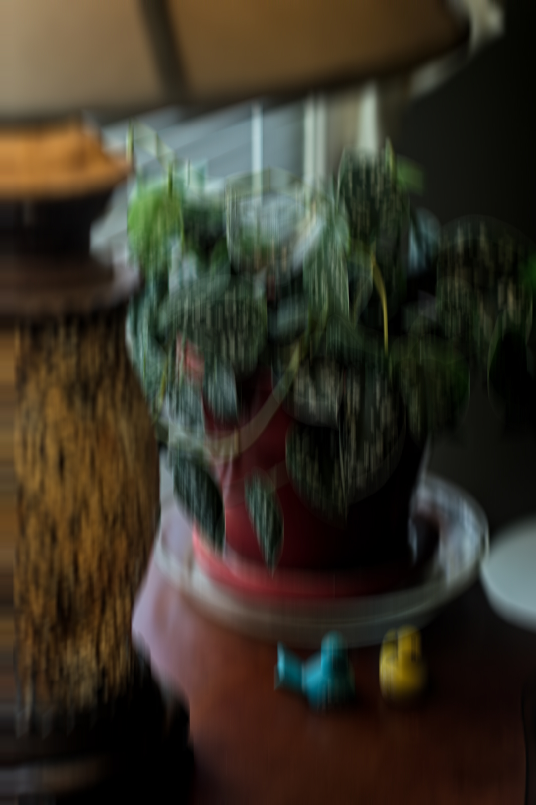
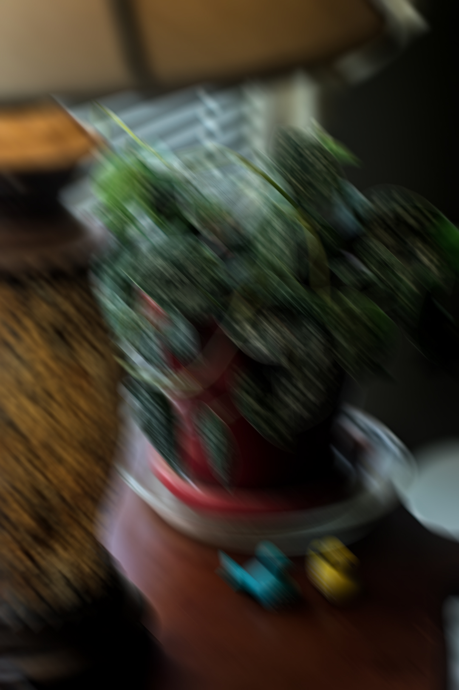

# Image Blurring Program

This program can apply various blur methods to an input image using
convolution.

## Features

- Load images in PNG or JPEG format.
- Various blur methods
- Customizable blur strength
- Save the processed image in PNG or JPEG format.

## Supported Blur Methods

- [x] Gaussian
- [x] Box
- [x] Bilateral
- [x] Median
- [x] Motion

## Blur Method Comparison

| Blurring Method | Original Image | Blurred Image |
|----------------|---------------|------------------|
| Gaussian |  |  |
| Box |  |  |
| Bilateral |  |  |
| Median |  |  |
| Motion (Horizontal) |  |  |
| Motion (Vertical) |  |  |
| Motion (Diagonal) |  |  |

## Dependencies

- [Boost](https://www.boost.org/) (specifically Boost.ProgramOptions)
- [stb_image](https://github.com/nothings/stb) for image loading and saving

## Installation

```
$ git clone https://github.com/khuei/blurrer.git
$ cd blurrer
$ make
$ make install
```

## Usage

```
$ blurrer --input <input_image> --output <output_image> [options]
```

Options:
- `-i`, `--input <input_image>`: Path to the input image file (required).
- `-o`, `--output <output_image>`: Path to save the output image file (required).
- `-a`, `--algo <algorithm>`: Set the algorithm for blurring (default: "gaussian").
- `-s`, `--strength <strength>`: Set the blur strength (default: 3).
- `-h`, `--help`: Display usage message.
